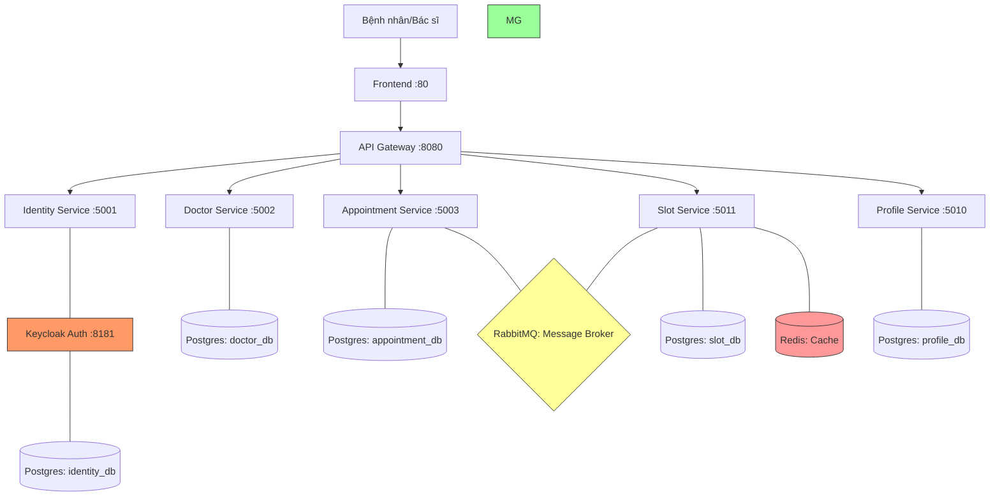

# MedBook - Hệ Thống Đặt Lịch Khám Bệnh Microservices

[](https://github.com/thuan2412004/microservices-assignment-starter/stargazers)
[](LICENSE)

> MedBook là giải pháp y tế số giúp tự động hóa quy trình đặt lịch khám bệnh, quản lý tài nguyên phòng khám và tối ưu hóa sự phối hợp giữa Bác sĩ và Bệnh nhân thông qua kiến trúc Microservices hiện đại.

---

## Thành Viên Đội Ngũ

| Tên | MSSV | Vai Trò | Đóng Góp Chính |
|------|------------|------|-------------|
| **Nguyễn Đình Thuân** | [B22DCCN840] | Doctor, Identity, Profile | Quản lý định danh bảo mật (Keycloak), đồng bộ hồ sơ người dùng và khóa lịch rảnh của Bác sĩ trong luồng giao dịch. |
| **Phùng Quốc Việt** | [B22DCCN900] | Slot, Eureka Server | Quản lý tài nguyên vật lý (Phòng, Máy móc) ngăn chặn đụng độ lịch; Vận hành hạ tầng Service Registry để nhận diện các dịch vụ. |
| **Đỗ Ngọc Minh** | [B22DCCN528] | Appointment, Gateway, Chat | Xây dựng Gateway kiểm soát truy cập; Định hướng Nhạc trưởng (Saga Orchestrator) luồng đặt lịch cốt lõi; Triển khai hệ thống Chat. |

---

## Quy Trình Nghiệp Vụ (Business Process)

**Nghiệp vụ trọng tâm: Đặt lịch khám bệnh và Giữ chỗ tài nguyên.**
*   **Tóm tắt**: Bệnh nhân chọn Bác sĩ và khung giờ trên ứng dụng. Hệ thống tự động thực hiện luồng giao dịch phân tán (Saga) để khóa lịch Bác sĩ, giữ chỗ Phòng và Thiết bị y tế tương ứng. Sau khi tất cả tài nguyên được đảm bảo, lịch hẹn được xác nhận.
*   **Phạm vi**: Từ lúc đăng ký tài khoản, quản lý hồ sơ bác sĩ đến khi hoàn tất quá trình đặt lịch.

---

## Kiến Trúc Hệ Thống (Architecture)



| Thành phần | Trách nhiệm | Công nghệ | Cổng |
|---------------|----------------|------------|------|
| **Frontend** | Giao diện người dùng | Vite, React/Vue | 80 |
| **Gateway** | Định tuyến, Bảo mật, Rate Limiting | Spring Cloud Gateway | 8080 |
| **Identity Service** | Quản lý tài khoản, tích hợp Keycloak | Spring Boot, Keycloak | 5001 |
| **Doctor Service** | Quản lý thông tin & lịch làm việc bác sĩ | Spring Boot, PostgreSQL | 5002 |
| **Appointment Svc** | Điều phối đặt lịch (Saga Orchestrator) | Spring Boot, PostgreSQL | 5003 |
| **Slot Service** | Quản lý tài nguyên Phòng/Thiết bị | Spring Boot, Redis | 5011 |
| **Profile Service** | Quản lý thông tin chi tiết người dùng | Spring Boot, PostgreSQL | 5010 |
| **Eureka Server** | Đăng ký và phát hiện dịch vụ | Spring Cloud Netflix | 8761 |

---

## Khởi Chạy Nhanh (Quick Start)

### 1. Chuẩn bị môi trường
Copy file mẫu và điền các thông tin bí mật (Email, API Key):
```bash
cp .env.example .env
```

### 2. Chạy ứng dụng bằng Docker
```bash
docker compose up --build -d
```
*(Docker sẽ tự động build code Java bên bản trong nên bạn không cần cài Java hay chạy script build bên ngoài).*

**Kiểm tra trạng thái:** 
*   Bảng điều khiển Eureka: `http://localhost:8761`
*   Giao diện người dùng: `http://localhost`
*   Kiểm tra Health: `http://localhost:8080/health` (Gateway)

---

## Tài Liệu (Documentation)

| Tài liệu | Mô tả |    
|----------|-------------|
| [`docs/saga-workflow.md`](docs/saga-workflow.md) | Chi tiết luồng Saga khóa tài nguyên (Phòng/Máy/Bác sĩ) |
| [`docs/architecture.md`](docs/architecture.md) | Phân tích chi tiết mô hình kiến trúc và triển khai |
| [`docs/analysis-and-design.md`](docs/analysis-and-design.md) | Phân tích yêu cầu và thiết kế hệ thống |
| [`docs/api-specs/`](docs/api-specs/) | Đặc tả API OpenAPI 3.0 cho từng service |

---

## Giấy Phép (License)

Dự án này sử dụng giấy phép [MIT License](LICENSE).
