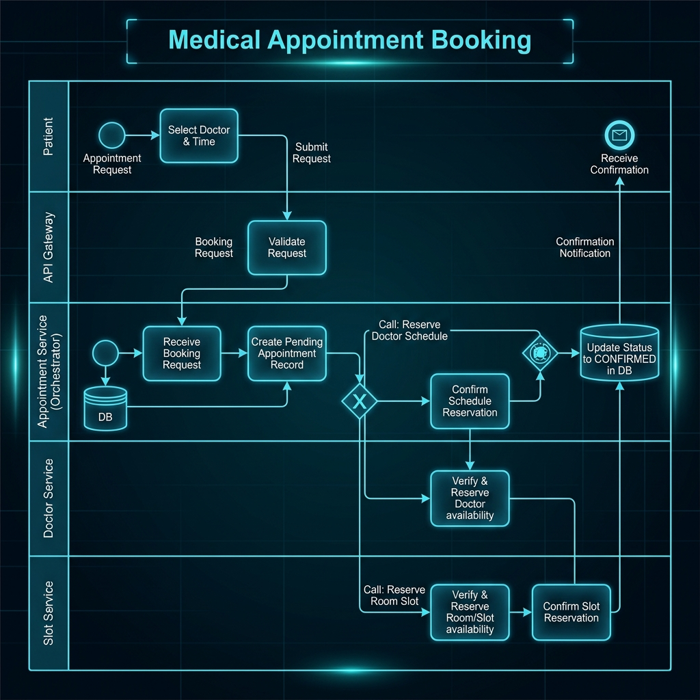
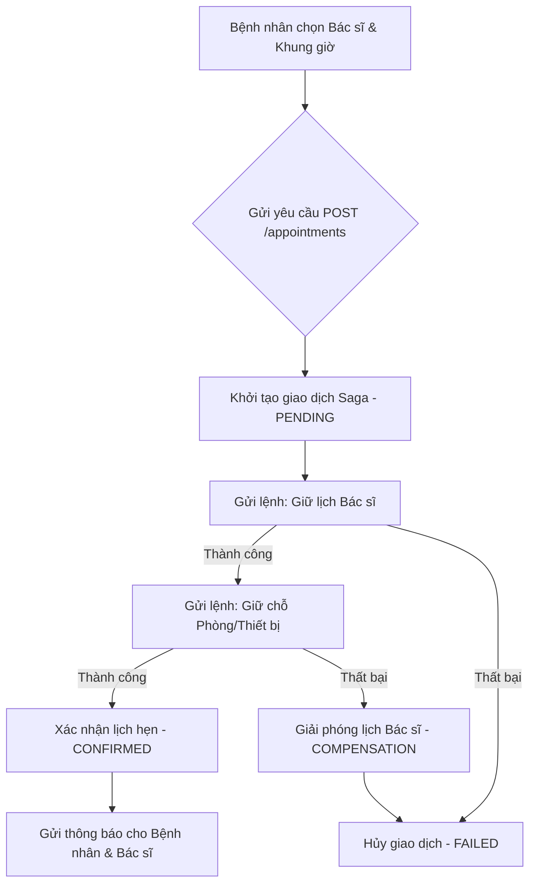
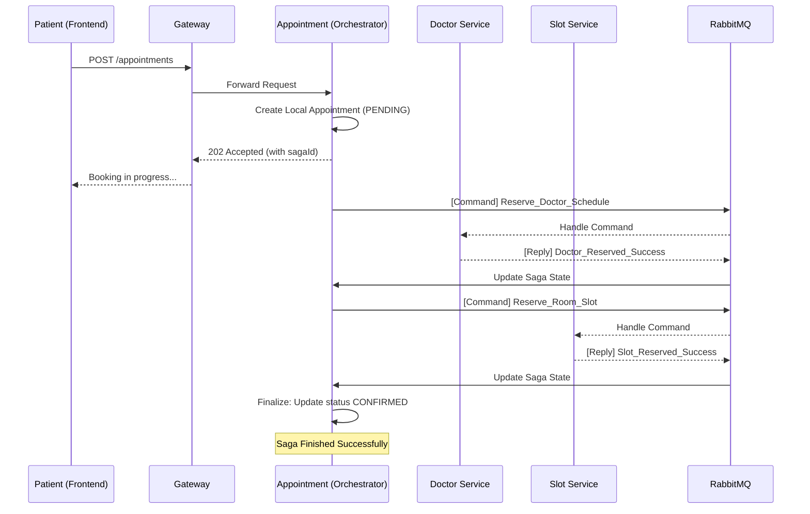
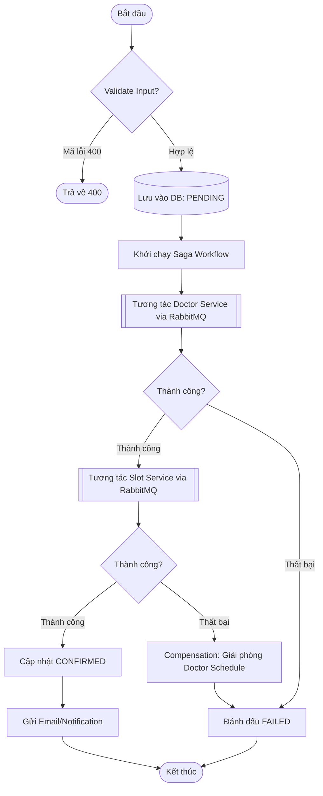
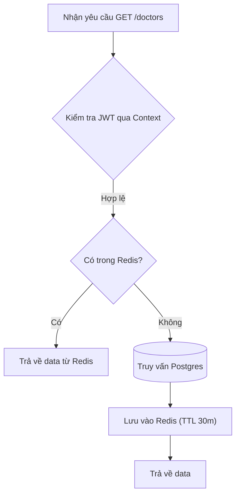
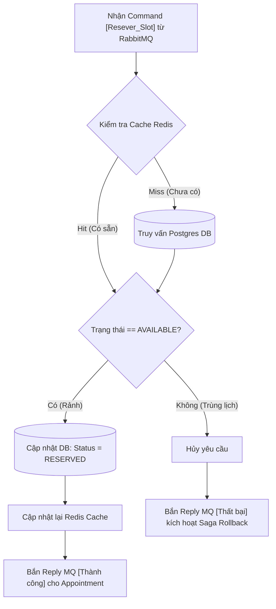

# Analysis and Design — Giải pháp Tự động hóa Quy trình Đặt lịch khám (Detailed)

> **Mục tiêu**: Phân tích và thiết kế chi tiết giải pháp vi dịch vụ (Microservices) cho quy trình đặt lịch khám bệnh trực tuyến tại hệ thống MedBook, áp dụng mô hình Saga Orchestration để đảm bảo tính nhất quán dữ liệu.

---

## Phần 1 — Chuẩn bị phân tích

### 1.1 Định nghĩa Quy trình Nghiệp vụ

- **Lĩnh vực (Domain)**: Y tế kỹ thuật số (Digital Healthcare / HealthTech).
- **Quy trình nghiệp vụ**: Đặt lịch hẹn khám bệnh trực tuyến (Online Medical Appointment Booking).
- **Tác nhân (Actors)**:
  - **Bệnh nhân**: Tìm kiếm, chọn bác sĩ, đặt lịch và theo dõi trạng thái.
  - **Bác sĩ**: Quản lý lịch biểu, xác nhận khám.
  - **Hệ thống**: Điều phối việc giữ chỗ tài nguyên (Bác sĩ, Phòng khám) và gửi thông báo.
- **Phạm vi (Scope)**: Từ bước khởi tạo yêu cầu đặt lịch thông qua API Gateway đến khi toàn bộ tài nguyên liên quan được xác nhận giữ chỗ thành công (Saga State: CONFIRMED) hoặc được giải phóng nếu có lỗi xảy ra (Rollback/Compensation).

**Sơ đồ quy trình (BPMN / Sequence Flow):**

*Sơ đồ Mermaid chi tiết:*

### 1.2 Các hệ thống tự động hóa hiện có

| Tên hệ thống | Loại | Vai trò hiện tại | Phương thức tương tác |
|-------------|------|--------------|-------------------|
| **Keycloak** | IAM  | Quản lý định danh, cung cấp JWT Access Token | OIDC / OAuth2 / OpenID |
| **RabbitMQ** | Message Broker | Điều phối các "Command" và "Reply" của luồng Saga | AMQP (với Spring Cloud Stream) |
| **PostgreSQL** | RDBMS | Lưu trữ trạng thái bền vững cho các service Java | JDBC / JPA / Hibernate |
| **MongoDB** | NoSQL | Lưu trữ tin nhắn và lịch sử hội thoại (Chat) | Mongoose / BSON |
| **Redis** | In-memory Cache | Caching trạng thái slot và bác sĩ để tăng tốc độ truy vấn | Jedis / Lettuce |
| **Eureka** | Registry | Quản lý danh sách các instance dịch vụ đang hoạt động | HTTP Heartbeat / REST |

### 1.3 Yêu cầu phi chức năng (Non-Functional Requirements)

| Yêu cầu       | Mô tả |
|----------------|-------------|
| **Performance** | Thời gian phản hồi cho các thao tác đọc (Read) < 150ms. Thao tác ghi (Write) bất đồng bộ trả về 202 Accepted < 300ms. |
| **Security**   | Xác thực tập trung qua Gateway dùng JWT. Dữ liệu nhạy cảm (PII) phải được mã hóa tại tầng ứng dụng. |
| **Scalability** | Hỗ trợ Horizontal Scaling cho `appointment-service` và `doctor-service` trong giờ cao điểm. |
| **Availability**| Độ khả dụng 99.9% (High Availability). Sử dụng Circuit Breaker (Resilience4j) tại Gateway. |
| **Consistency** | Đảm bảo tính nhất quán sau cùng (Eventual Consistency) thông qua cơ chế Retry và Compensation của Saga. |

---

## Phần 2 — Mô hình hóa REST/Microservices

### 2.1 & 2.2 Phân rã quy trình & Lọc các hành động

| # | Hành động | Tác nhân | Mô tả | Phù hợp Service? |
|---|--------|-------|-------------|-------------|
| 1 | Tìm kiếm bác sĩ | Bệnh nhân | Tra cứu theo tên, chuyên khoa, phòng khám | ✅ |
| 2 | Xem lịch trống | Bệnh nhân | Lấy danh sách khung giờ (slots) khả dụng | ✅ |
| 3 | Xác thực quyền | Hệ thống | Kiểm tra JWT và Role (PATIENT) | ✅ |
| 4 | Lưu yêu cầu đặt lịch| Hệ thống | Ghi tạm trạng thái `BOOKING_PENDING` | ✅ |
| 5 | Khám lâm sàn | Bác sĩ | Thao tác vật lý tại phòng khám | ❌ (Manual) |
| 6 | Giữ chỗ Slot vật lý | Hệ thống | Đánh dấu phòng/thiết bị là `RESERVED` | ✅ |
| 7 | Gửi tin nhắn tư vấn | Bệnh nhân | Chat trực tuyến với bác sĩ trước/sau khám | ✅ |

### 2.3 Thực thể Service Candidates (Agnostic - Reusable)

| Thực thể | Service Candidate | Các hành động tái sử dụng |
|--------|-------------------|------------------|
| **Identity** | Identity Service | Đăng ký, đăng nhập (bridge to Keycloak), phân quyền người dùng. |
| **Doctor** | Doctor Service | Quản lý profile bác sĩ, chuyên khoa, định nghĩa lịch làm việc (Schedule). |
| **Slot** | Slot Service | Quản lý trạng thái các phòng chức năng, thiết bị y tế (Vật chất). |
| **Profile** | Profile Service | Thông tin cá nhân bệnh nhân, tiền sử bệnh án cơ bản. |
| **Chat** | Chat Service | Tin nhắn thời gian thực, lưu trữ lịch sử hội thoại. |

### 2.4 Nhiệm vụ Service Candidate (Task - Process Specific)

| Hành động đặc thù | Task Service Candidate |
|---------------------|------------------------|
| **Điều phối giao dịch Saga** | **Appointment Service** |
| Xử lý logic nghiệp vụ đặt lịch, quản lý trạng thái vòng đời của một Click đặt lịch, điều phối các service thực thể. | |

### 2.5 Xác định Tài nguyên (Resources)

| Thực thể / Quy trình | Resource URI |
|------------------|--------------|
| Bác sĩ | `/api/v1/doctor/doctors` |
| Lịch bác sĩ | `/api/v1/doctor/doctor-schedules` |
| Phòng khám/Thiết bị | `/api/v1/slot/slots` |
| Hồ sơ cá nhân | `/api/v1/profile/users/me` |
| Lịch hẹn | `/api/v1/appointment/appointments` |
| Hội thoại | `/api/v1/chat/messages` |

### 2.6 Gắn kết Capability với Resources và Phương thức

| Service Candidate | Capability | Resource | HTTP Method |
|-------------------|------------|----------|-------------|
| **Identity** | Đăng ký tài khoản người dùng mới | `/users/registration` | POST |
| **Doctor** | Tra cứu danh sách bác sĩ & chuyên khoa | `/doctors` | GET |
| **Doctor** | Giữ chỗ lịch bác sĩ (Internal/Saga) | `/doctor-schedules/{id}/reserve` | POST |
| **Appointment**| Khởi tạo quy trình đặt lịch lâm sàng | `/appointments` | POST |
| **Appointment**| Kiểm tra trạng thái giao dịch Saga | `/appointments/{id}/status` | GET |
| **Slot** | Kiểm tra tài nguyên vật lý rảnh | `/available` | GET |
| **Slot** | Giữ chỗ phòng/thiết bị (Internal/Saga) | `/{id}/book` | POST |
| **Profile** | Truy vấn thông tin hồ sơ cá nhân | `/users/me` | GET |
| **Chat** | Truy vấn lịch sử hội thoại | `/conversations` | GET |

### 2.7 Tiện ích (Utility) & Microservice Candidates

| Candidate | Loại | Lý do lựa chọn |
|-----------|---------------|---------------|
| **Gateway** | Utility | Tập trung hóa Routing, SSL Terminations, xử lý CORS cho Frontend. |
| **Eureka** | Utility | Giải quyết vấn đề Dynamic IP trong môi trường cụm (Cluster), giúp các service gọi nhau qua tên. |
| **Identity** | Microservice | Tách biệt hoàn toàn logic User khỏi Business Domain, tương tác chặt chẽ với Keycloak. |

### 2.8 Phối hợp giữa các Service (Saga Collaboration)

---

## Phần 3 — Thiết kế hướng dịch vụ

### 3.1 Thiết kế Hợp đồng Thống nhất (Uniform Contract Design)

Phần này đặc tả các điểm cuối (endpoints) quan trọng nhất cho từng dịch vụ, ánh xạ từ các khả năng (capabilities) đã xác định ở Phần 2.

Đặc tả OpenAPI đầy đủ tại thư mục: [`docs/api-specs/`](api-specs/)

#### 1. Identity Service (Xác thực & Định danh)
| Endpoint | Method | Description | Request Body | Response Codes |
|----------|--------|-------------|--------------|----------------|
| `/users/registration` | POST | Đăng ký tài khoản bệnh nhân mới | `UserCreationRequest` | 200, 400 |
| `/users/my-info` | GET | Lấy thông tin tài khoản hiện tại | N/A | 200, 401 |
| `/users` | GET | Danh sách người dùng (Admin chỉ định) | N/A | 200, 403 |

#### 2. Profile Service (Thông tin Cá nhân)
| Endpoint | Method | Description | Request Body | Response Codes |
|----------|--------|-------------|--------------|----------------|
| `/users/me` | GET | Lấy hồ sơ chi tiết người dùng hiện tại | N/A | 200, 401 |
| `/users/me` | PUT | Cập nhật thông tin hồ sơ, ảnh đại diện | `UpdateMyProfileRequest`| 200, 400 |
| `/internal/users` | POST | Đồng bộ hồ sơ từ Identity (Internal) | `CreateInternalProfileRequest`| 200, 409 |

#### 3. Doctor Service (Quản lý Bác sĩ & Lịch làm việc)
| Endpoint | Method | Description | Request Body | Response Codes |
|----------|--------|-------------|--------------|----------------|
| `/doctors` | GET | Tìm kiếm danh sách bác sĩ | N/A (Query Params) | 200 |
| `/doctors/{id}` | GET | Xem thông tin chi tiết và chuyên môn | N/A | 200, 404 |
| `/doctor-schedules/{id}/reserve` | POST | Giữ chỗ khung giờ (Sử dụng bởi Saga) | `{"appointmentId": string}` | 200, 400 |

#### 4. Appointment Service (Điều phối Đặt lịch - Saga)
| Endpoint | Method | Description | Request Body | Response Codes |
|----------|--------|-------------|--------------|----------------|
| `/appointments` | POST | Khởi tạo quy trình đặt lịch (Asynchronous) | `CreateAppointmentRequest`| 202, 400 |
| `/appointments/my` | GET | Xem danh sách lịch hẹn cá nhân | N/A | 200, 401 |
| `/appointments/{id}/status` | GET | Kiểm tra trạng thái Saga (Polling) | N/A | 200, 404 |

#### 5. Slot Service (Quản lý Tài nguyên Vật lý)
| Endpoint | Method | Description | Request Body | Response Codes |
|----------|--------|-------------|--------------|----------------|
| `/available` | GET | Kiểm tra phòng/thiết bị rảnh | N/A (Query Params) | 200 |
| `/{slotId}/book` | POST | Khóa tạm thời slot vật lý (Saga) | `{}` | 200, 404 |
| `/{slotId}/release`| POST | Giải phóng slot (Compensation) | N/A | 200 |

#### 6. Chat Service (Tư vấn trực tuyến)
| Endpoint | Method | Description | Request Body | Response Codes |
|----------|--------|-------------|--------------|----------------|
| `/conversations` | GET | Danh sách các cuộc hội thoại hiện có | N/A | 200 |
| `/conversations/{id}/messages`| GET | Lấy lịch sử tin nhắn trong hội thoại | N/A | 200, 404 |
| `Socket.IO: message:send` | WS | Gửi tin nhắn thời gian thực | `{conversationId, content}` | N/A |

### 3.2 Thiết kế Logic nội bộ Service

**Appointment Service (Saga Orchestration Logic):**

**Doctor Service (Query Logic):**

**Slot Service (Resource Lock Logic):**

Thiết kế đặc thù sử dụng khóa để tránh tình trạng Race Condition khiến nhiều bệnh nhân cùng đặt được một phòng khám/máy móc tại cùng một khung giờ.

