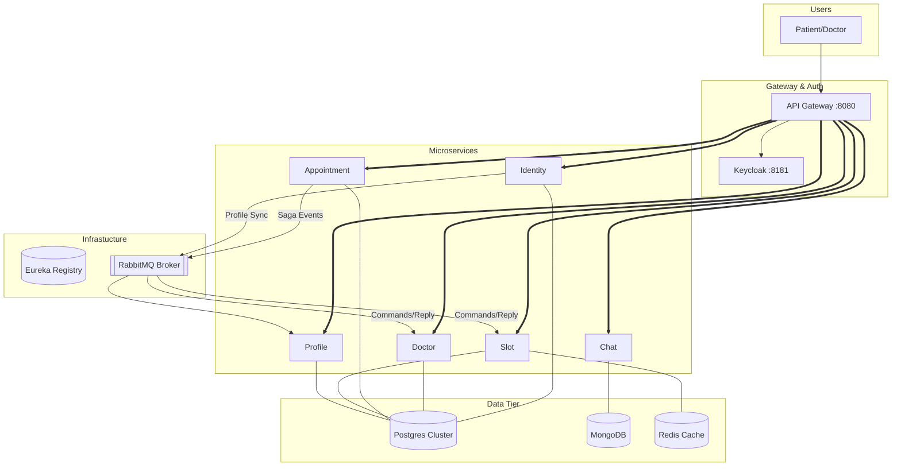

# System Architecture — MedBook Solution

> This document is completed **after** the Analysis and Design phase.
> It describes the concrete technical implementation of the service candidates identified in [Analysis and Design](analysis-and-design.md).

---

## 1. Pattern Selection

Select patterns based on business/technical justifications from the analysis phase.

| Pattern | Selected? | Business/Technical Justification |
|---------|-----------|----------------------------------|
| **API Gateway** | ✅ | Cửa ngõ duy nhất (Spring Cloud Gateway) để quản lý luồng traffic, xử lý CORS và định tuyến đến các microservices ẩn phía sau. |
| **Database per Service** | ✅ | Đảm bảo tính đóng gói dữ liệu và cho phép mỗi dịch vụ chọn loại DB phù hợp (Postgres cho giao dịch, MongoDB cho tin nhắn chat). |
| **Shared Database** | ❌ | Tránh sự phụ thuộc chặt chẽ (Tight Coupling) giữa các dịch vụ. |
| **Saga (Orchestration)** | ✅ | Áp dụng tại `appointment-service` để điều phối giao dịch phân tán giữa Doctor và Slot service, đảm bảo tính nhất quán dữ liệu. |
| **Event-driven / MQ** | ✅ | Sử dụng RabbitMQ để truyền tin nhắn bất đồng bộ trong luồng Saga và đồng bộ dữ liệu người dùng giữa Identity và Profile. |
| **CQRS** | ❌ | Chưa cần thiết cho quy mô hiện tại, nhưng có thể cân nhắc nếu luồng Read bác sĩ tăng quá cao. |
| **Circuit Breaker** | ✅ | Cài đặt với **Resilience4j** tích hợp vào Spring Cloud Gateway. Mỗi route có 1 CB riêng, fallback trả về `503 SERVICE_UNAVAILABLE` thay vì lỗi connection timeout. |
| **Service Registry** | ✅ | Netflix Eureka giúp các dịch vụ tự động đăng ký và tìm thấy nhau qua tên (Service ID) thay vì IP tĩnh. |
 **out/inbox pattern** | ✅ | Giúp các event chắc chắn được gửi và chỉ được đúng một lần. |
 **observability logging** | ✅ | Có logging giúp debug dễ  hơn  |

---

## 2. System Components

| Component     | Responsibility | Tech Stack      | Port  |
|---------------|----------------|-----------------|-------|
| **Frontend**  | Giao diện người dùng (Bệnh nhân/Bác sĩ) | React.js / Vite | 3000  |
| **Gateway**   | Định tuyến, xác thực JWT tập trung | Spring Cloud Gateway | 8080  |
| **Eureka**    | Đăng ký và phát hiện dịch vụ | Netflix Eureka | 8761  |
| **Keycloak**  | Quản lý định danh (Identity Provider) | Keycloak (OIDC) | 8181  |
| **Identity**  | Cầu nối người dùng tới Keycloak | Spring Boot/Postgres| 5001  |
| **Doctor**    | Quản lý thông tin hồ sơ & lịch bác sĩ | Spring Boot/Postgres| 5002  |
| **Appointment**| Động cơ đặt lịch & Điều phối Saga | Spring Boot/Postgres| 5003  |
| **Chat**      | Tin nhắn thời gian thực | Node.js/MongoDB | 5006  |
| **Profile**   | Hồ sơ bệnh nhân chi tiết | Spring Boot/Postgres| 5010  |
| **Slot**      | Quản lý tài nguyên vật lý | Spring Boot/Postgres| 5011  |

---

## 3. Communication

### Inter-service Communication Matrix

| From ↓ | To → | Gateway | Identity | Doctor | Appointment | Slot | Database |
|---------------|:---:|:---:|:---:|:---:|:---:|:---:|:---:|
| **Frontend**  | REST | - | - | - | - | - | - |
| **Gateway**   | - | REST | REST | REST | REST | REST | - |
| **Identity**  | - | - | - | - | - | - | JDBC |
| **Doctor**    | - | - | - | - | - | - | JDBC |
| **Appointment**| - | - | gRPC/MQ| - | gRPC/MQ| JDBC |
| **Chat**      | - | - | - | - | - | - | BSON |

*Ghi chú: MQ (RabbitMQ) được dùng cho flow Saga bất đồng bộ. gRPC được dùng cho các truy vấn kiểm tra trạng thái nhanh nội bộ.*

---

## 4. Architecture Diagram

Sơ đồ mô hình hóa luồng dữ liệu và cấu trúc tầng dịch vụ:



---

## 5. Deployment

Hệ thống được thiết kế để triển khai linh hoạt dưới dạng Containers:

- **Containerization**: Toàn bộ các dịch vụ và cơ sở dữ liệu được đóng gói bằng **Docker**.
- **Orchestration**: Sử dụng **Docker Compose** để điều phối việc khởi chạy theo đúng thứ tự (Database/Infra -> Services).
- **Single Command**: Toàn bộ hệ thống có thể khởi chạy chỉ với một lệnh duy nhất từ thư mục gốc:
  ```bash
  docker compose up --build -d
  ```
- **Environment**: Cấu hình tập trung tại file `.env` để quản lý các biến môi trường cho tất cả các service.
