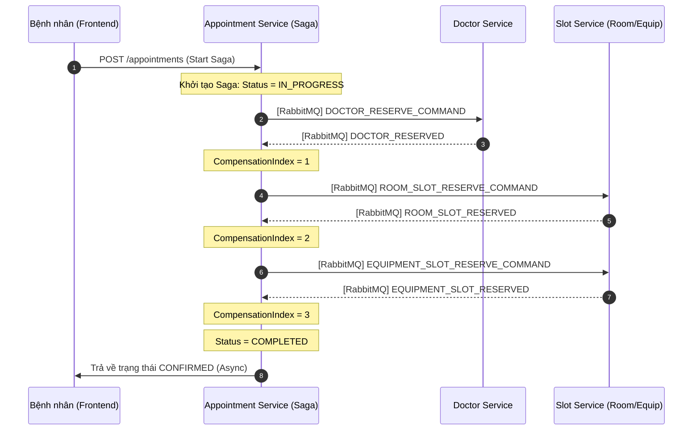
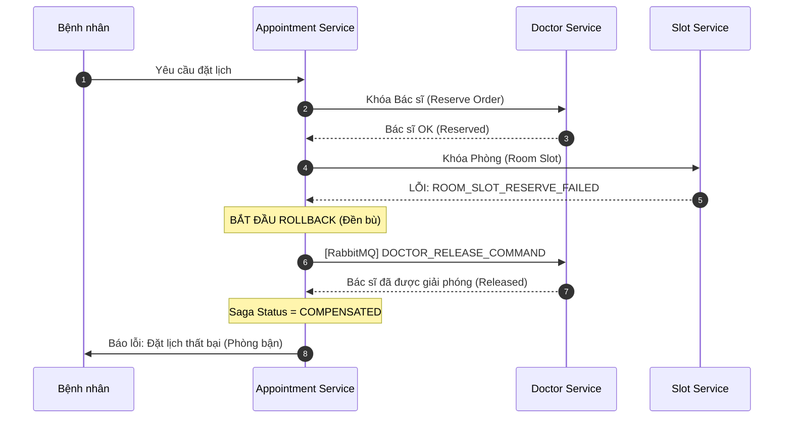
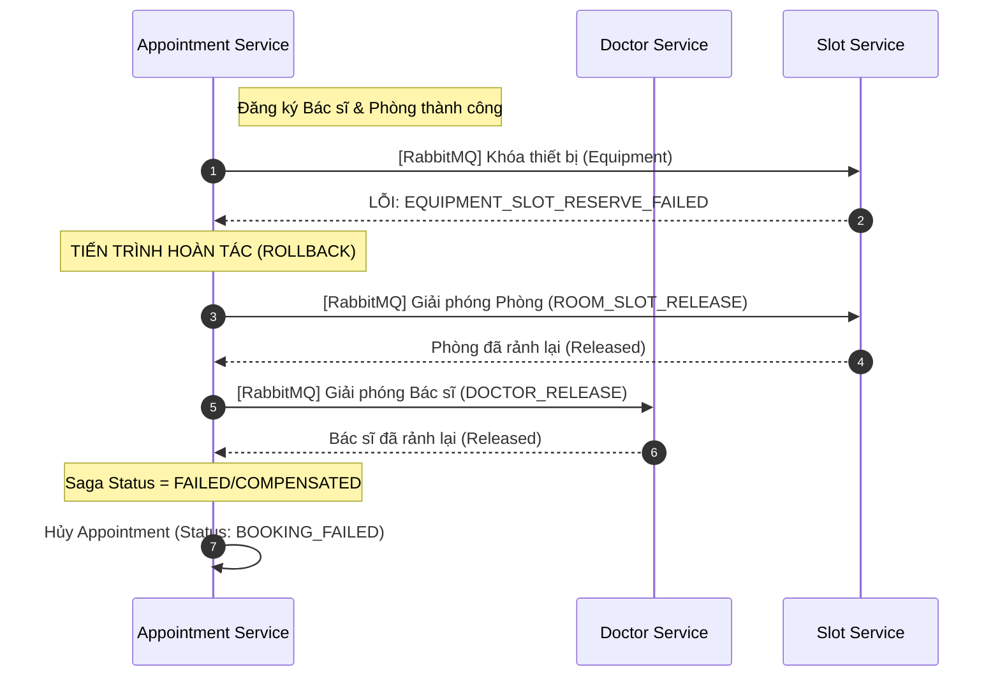

# MedBook Appointment Saga Workflow

Tài liệu này mô tả chi tiết các kịch bản của luồng đặt lịch khám (Appointment Booking) sử dụng Saga Pattern (Choreography/Orchestration-based) trong hệ thống Microservices MedBook.

---

## 1. Kịch bản Thành công (Happy Path)
Đây là trường hợp lý tưởng khi tất cả tài nguyên (Bác sĩ, Phòng, Máy) đều sẵn sàng.

---

## 2. Kịch bản Lỗi tại bước Khóa Phòng (Rollback Bác sĩ)
Xảy ra khi Bác sĩ rảnh nhưng căn phòng vừa bị người khác đặt mất hoặc gặp sự cố kỹ thuật tại Slot Service.

---

## 3. Kịch bản Lỗi tại bước Khóa Thiết Bị (Rollback Phức Tạp)
Đây là kịch bản hoàn tác toàn bộ khi các tài nguyên trước đó đã OK nhưng tài nguyên cuối cùng thất bại.

---

## 4. Chi tiết Kỹ thuật (Technical Notes)

| Đại lượng | Chi tiết |
| :--- | :--- |
| **Cơ chế truyền tin** | RabbitMQ (Asynchronous Messaging) |
| **Logic Rollback** | Dựa trên `compensationIndex` trong database để xác định các bước đã thực hiện thành công và cần đảo ngược. |
| **Hàm xử lý chính** | `handleReply` và `handleCompensationReleased` trong `AppointmentBookingSaga.java`. |
| **Tình trạng nhất quán** | Đạt mức **Eventual Consistency** (Nhất quán sau cùng). |

---
*Tài liệu được sinh tự động bởi Antigravity AI Assistant.*
