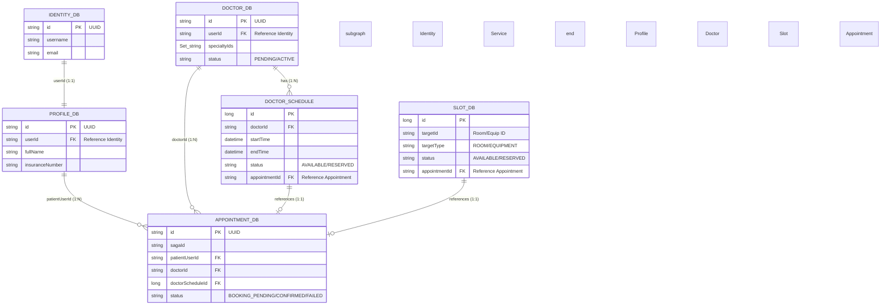

# System Entity Relationship Overview (Liên thông dữ liệu) - Đã cập nhật chuẩn 100%

Sơ đồ mô tả mối quan hệ logic của dữ liệu dựa trên mã nguồn thực tế của các Entity trong hệ thống MedBook.

## Các điểm kỹ thuật chính chủ

1.  **Định danh (Identifiers)**: 
    *   Hầu hết các thực thể chính (`User`, `Doctor`, `Appointment`) sử dụng **UUID (String)** để đảm bảo tính duy nhất trên toàn hệ thống phân tán.
    *   Các thực thể phụ hoặc mang tính thời điểm (`Slot`, `DoctorSchedule`) sử dụng **Long (Auto-increment)** để tối ưu hiệu năng truy vấn theo thời gian.
2.  **Tính nhất quán qua Saga**:
    *   Khi `Appointment` ở trạng thái `BOOKING_PENDING`, các ID của nó sẽ được gửi sang `Doctor` và `Slot` service để thực hiện lệnh "Khóa" (Reserve).
    *   Chỉ khi nhận được phản hồi thành công từ tất cả, `Appointment` mới chuyển sang `CONFIRMED`.
3.  **Dữ liệu Chat**: Dịch vụ Chat lưu trữ trong MongoDB với cấu trúc Schema-less nên không xuất hiện trong sơ đồ quan hệ chặt chẽ này, nhưng nó liên kết với các dịch vụ khác qua `participantId` (chính là `userId`).
